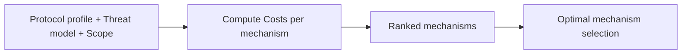

# Intervention Mechanism Calculator (v1)

> **Context:** This document outlines the rationale, mathematical logic, and specification for a quantitative decision-support tool based on the Elem-Nimrod "Scope × Authority" Paper. It translates the paper's stochastic model into a practical utility for protocol architects, DAO delegates, and risk assessors.

---

## 1. Value Proposition

**"Moving from Vibes to Math"**

Currently, emergency governance decisions are driven by ideology ("Decentralization good") or vague fear ("We need a kill switch"). This calculator quantifies the trade-offs, enabling stakeholders to make defensible, data-driven choices.

*   **For Architects:** "Should I hardcode a pause function?" → "Does the reduction in Expected Hack Loss exceed the 'Constitutional Crisis' cost of activation?"
*   **For Delegates:** "Should we vote for the Security Council?" → "Is the efficiency gain (faster containment) worth the legitimacy penalty?"
*   **For Regulators/Issuers:** Providing a formal derivation for why specific emergency powers are necessary for safety.

---

## 2. Core Logic & Variables

The tool solves for the **Optimal Mechanism (m\*)** that minimizes the Total Expected Social Cost.

**v1 Formula:**
$$
\text{ExpectedCost}(m) = \underbrace{\text{CentralizationCost}(m)}_{\text{Trust Cost}} + P(h) \cdot [\underbrace{\text{BlastRate}(m, s)}_{\text{Fixed Scope Cost}} + \underbrace{T(m) \cdot D(h)}_{\text{Exploit Loss}}]
$$

Where:
- **CentralizationCost(m)**: Fixed activation penalty + duration-based trust erosion.
- **BlastRate(m, s)**: One-time collateral damage based on Scope ($s$).
- **P(h)**: Probability of a hack/exploit.
- **C_exploit(m)**: Time-dependent loss from the exploit ($T(m) \times D(h)$).



---

## 3. Variable Definitions & Calibration

### A. Legitimacy Cost: C_legitimacy
**Definition:** The political cost of invoking an emergency power. In v1, this is modeled as a **Fixed Activation Cost** (a "trust breach" or "constitutional crisis") plus a small duration-based erosion.

**Formula:**
$$
C_{legitimacy} = (\text{FixedPenalty} + \text{DurationErosion}) \times \text{SentimentFactor}
$$

**Parameters:**
- **Fixed Activation Penalty**:
    - **Signer Set:** 0.05% of Market Cap (High penalty for unilateral executive action).
    - **Delegated Body:** 0.01% of Market Cap (Moderate penalty).
    - **Governance:** 0.00% (No penalty; standard legislative process).
- **Duration Erosion**: 1% annualized trust loss per minute of emergency state.

### B. Containment Time: T(m)
**Definition:** Time (in minutes) from detection to successful intervention.

**Defaults (v1):**
- **Signer Set:** 30 minutes (Executive action)
- **Delegated Body:** 360 minutes (6 hours; Committee deliberation)
- **Governance:** 4320 minutes (3 days; Legislative process)

### C. Blast Cost: BlastRate
**Definition:** **One-time** economic value lost by the intervention itself (e.g., immediate market repricing, frozen assets). It is a **Fixed Cost** based on Scope, **not** multiplied by duration. "The market prices in the pause immediately."

**Formula:**
$$
\text{BlastRate} = \text{DailyVolume} \times \text{Blast\%}(s) \times \text{SentimentFactor}
$$

**Scope Levels (Blast%):**
- **Asset:** 1% (Single token freeze)
- **Account:** 2% (Specific address freeze)
- **Module:** 5% (Specific contract pause)
- **Protocol:** 15% (Entire protocol pause)
- **Network:** 50% (L1/L2 chain halt)

### D. Exploit Cost & Probability
- **Damage Rate D(h)**: Speed of exploit ($/min).
- **Threat Probability P(h)**: Likelihood of the specific threat type (e.g., 2.5% for Logic Bugs).

---

## 4. Political Analogies

The calculator maps mechanisms to familiar governance structures:

| Mechanism | Political Analogy | Speed | Legitimacy Penalty |
|-----------|------------------|-------|-----------------|
| **Signer Set** | Executive / Oligarchy | Fastest (30 min) | Highest (0.05% fixed) |
| **Delegated Body** | Representative Democracy | Medium (6 hours) | Moderate (0.01% fixed) |
| **Governance** | Direct Democracy | Slowest (3 days) | Lowest (Zero fixed) |

---

## 5. Interpreting Outputs

The calculator returns a ranked list of mechanisms by **Total Expected Cost**.

### Scenario 1: High Urgency (Signer Set Wins)
**Profile:** Protocol Logic Bug ($10k/min), Protocol Scope.
- **Result:** **Signer Set** wins. The massive exploit cost savings (> $1M vs Governance) outweigh the fixed legitimacy penalty (~$50k).
- **Logic:** "Constitutional crisis is preferable to total collapse."

### Scenario 2: Medium Urgency (Delegated Body Wins)
**Profile:** Account Compromise ($1k/min), Account Scope.
- **Result:** **Delegated Body** wins. Lower collateral damage (Account scope) and lower damage rate means Signer Set's speed isn't worth the high political cost, but Governance is still too slow.
- **Logic:** "Representative balance."

### Scenario 3: Low Urgency (Governance Wins)
**Profile:** Asset Freeze / Lost Keys ($10/min), Asset Scope.
- **Result:** **Governance** wins. Damage accrues slowly. Paying the "dictatorship tax" for a Signer Set is irrational when a 3-day vote costs almost nothing in lost funds.
- **Logic:** "Business as usual."

### Scenario 4: Existential Crisis (Delegated Body / Signer Set)
**Profile:** L1 Chain Halt ($1M/min), Network Scope.
- **Result:** **Delegated Body** (or Signer Set).
- **Logic:** With a Chain Halt (50% Blast Cost), the intervention itself is catastrophic ($240M+). Governance is too slow ($4B+ damage). Tipping point between Signer Set and Delegated Body depends on whether saving 5.5 hours is worth the extra centralization penalty.
- **Alignment:** Matches Gnosis Chain's framework (high "Fund Percentage" justifies extreme measures).

---

## 6. Implementation Reference

### Python Class Signature (v1)

```python
class InterventionCalculator:
    # Fixed Legitimacy Activation Cost
    BASE_ACTIVATION_COSTS = {
        'Signer Set': 0.0005,
        'Delegated Body': 0.0001,
        'Governance': 0.0,
    }
    
    # Scope dimension (One-time blast cost)
    SCOPE_LEVELS = {
        'Asset': {'blast_pct': 0.01},
        'Account': {'blast_pct': 0.02},
        'Module': {'blast_pct': 0.05},
        'Protocol': {'blast_pct': 0.15},
        'Network': {'blast_pct': 0.50},
    }
    
    def __init__(
        self, 
        market_cap: float, 
        daily_volume: float, 
        damage_rate_per_min: float,
        threat_probability: float = 0.01, 
        sentiment_score: float = 0.0,
        scope: str = 'Protocol', 
        governance_time_minutes: int = 4320, 
        is_regulated: bool = False
    ):
        ...

    def total_expected_cost(self, mechanism: str) -> float:
        return (self.centralization_cost(mechanism) + 
                self.blast_rate(mechanism) + 
                self.threat_prob * self.expected_exploit_cost(mechanism))
```

### Usage Example

```python
# Low Urgency / Asset Scope
calc = InterventionCalculator(
    market_cap=100_000_000,
    daily_volume=1_000_000,
    damage_rate_per_min=10,
    scope='Asset'
)
# Returns 'Governance'
```

---

## 7. Advanced Configuration (v1 Features)

While v1 focuses on Scope and Fixed Activation costs, the model supports extended parameters for specialized use cases:

### A. Regulatory Premium (`is_regulated`)
For RWA or payment chains, centralization is a feature, not a bug.
- **Logic:** If `is_regulated=True`, the `centralization_cost` becomes negative (a premium) or reduced to zero, reflecting institutional preference for Signer Set control.
- **Outcome:** Signer Set becomes optimal even for low-urgency events.

### B. Configurable Governance Time (`governance_time_minutes`)
Standard governance is 3 days (4320 min), but this can be adjusted:
- **Optimism/Arbitrum:** 7-14 days.
- **Emergency DAO:** 24 hours.
- **Impact:** Longer times significantly increase the `P(h) * T(m) * D(h)` component, making Governance less viable for technical exploits.

---

## 8. Validation Methodology

**Data Source:** LIF (Legitimate Intervention Framework) dataset
- **Ground Truth:** 52 curated intervention cases (`lif_intervention_metrics.csv`).
- **Calibration:** Parameters derived from historical incident analysis (e.g., Ronin, BNB Chain, Curve).

**Falsifiability:**
- The model is falsifiable if it recommends mechanisms that historically led to protocol collapse or user revolt in similar circumstances. v1 recommendations align with the "Legitimate Overrides in Decentralized Protocols" paper's findings.

---

## 9. References

- **Paper:** Elem & Talmon, "Legitimate Overrides in Decentralized Protocols"
- **Implementation:** `notebooks/paper_analysis_complete.ipynb`
